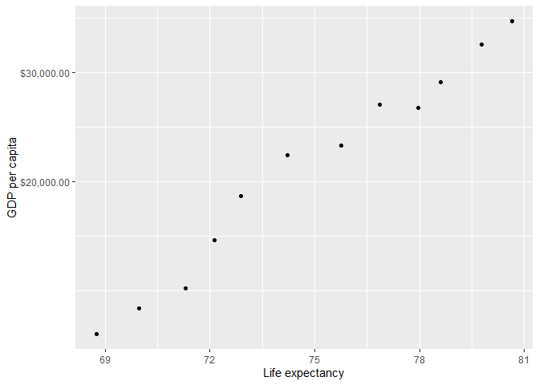
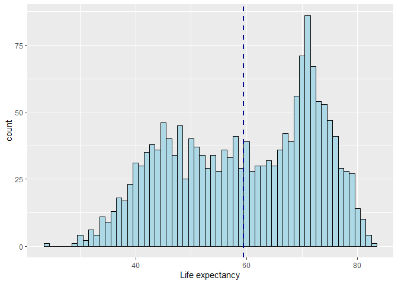
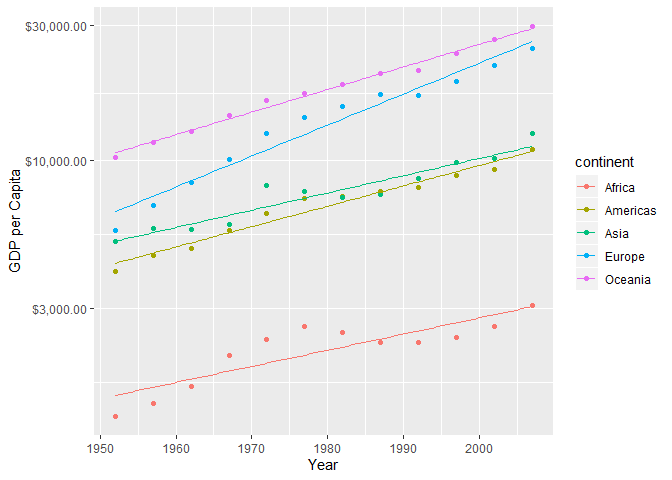
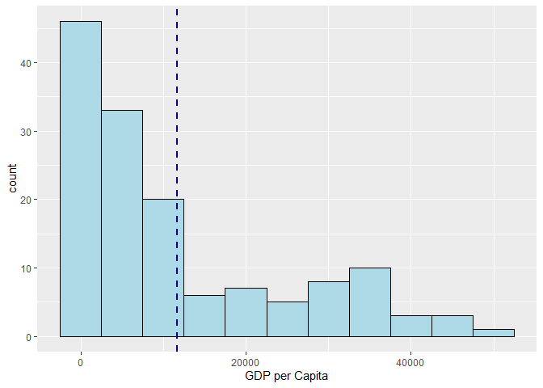

Assignment 2
================
Annie
24/09/2019

1.1. This table shows gapminder data for Canada, USA, and Mexico in the
1970’s.

``` r
gapminder_70 <- gapminder %>%
  filter(country == 'Canada' | country == 'United States' | country == 'Mexico') %>% 
  filter(year >= 1970 & year < 1980)
gapminder_70
```

    ## # A tibble: 6 x 6
    ##   country       continent  year lifeExp       pop gdpPercap
    ##   <fct>         <fct>     <int>   <dbl>     <int>     <dbl>
    ## 1 Canada        Americas   1972    72.9  22284500    18971.
    ## 2 Canada        Americas   1977    74.2  23796400    22091.
    ## 3 Mexico        Americas   1972    62.4  55984294     6809.
    ## 4 Mexico        Americas   1977    65.0  63759976     7675.
    ## 5 United States Americas   1972    71.3 209896000    21806.
    ## 6 United States Americas   1977    73.4 220239000    24073.

1.2. To hone in on my dataset from 1.1, I used the pipe operator %\>% to
select “country” and “gdpPercap”.

``` r
gapminder_select <- gapminder_70 %>%
  select(country, gdpPercap)
gapminder_select
```

    ## # A tibble: 6 x 2
    ##   country       gdpPercap
    ##   <fct>             <dbl>
    ## 1 Canada           18971.
    ## 2 Canada           22091.
    ## 3 Mexico            6809.
    ## 4 Mexico            7675.
    ## 5 United States    21806.
    ## 6 United States    24073.

1.3. This table shows all entries in the gapminder data that have
experienced a drop in life expectancy.

``` r
lifeexp_drop <- gapminder %>%
  arrange(country, year) %>%
  group_by(country) %>%
  mutate(lifeExplag = lag(lifeExp)) %>%
  mutate(lifeExpdif = lifeExp - lifeExplag) %>%
  filter(lifeExpdif < 0)
lifeexp_drop
```

    ## # A tibble: 102 x 8
    ## # Groups:   country [52]
    ##    country  continent  year lifeExp     pop gdpPercap lifeExplag lifeExpdif
    ##    <fct>    <fct>     <int>   <dbl>   <int>     <dbl>      <dbl>      <dbl>
    ##  1 Albania  Europe     1992    71.6 3326498     2497.       72       -0.419
    ##  2 Angola   Africa     1987    39.9 7874230     2430.       39.9     -0.036
    ##  3 Benin    Africa     2002    54.4 7026113     1373.       54.8     -0.371
    ##  4 Botswana Africa     1992    62.7 1342614     7954.       63.6     -0.877
    ##  5 Botswana Africa     1997    52.6 1536536     8647.       62.7    -10.2  
    ##  6 Botswana Africa     2002    46.6 1630347    11004.       52.6     -5.92 
    ##  7 Bulgaria Europe     1977    70.8 8797022     7612.       70.9     -0.09 
    ##  8 Bulgaria Europe     1992    71.2 8658506     6303.       71.3     -0.15 
    ##  9 Bulgaria Europe     1997    70.3 8066057     5970.       71.2     -0.87 
    ## 10 Burundi  Africa     1992    44.7 5809236      632.       48.2     -3.48 
    ## # ... with 92 more rows

1.4. Gapminder data is filtered to show the max GDP per capita
experienced by each country.

``` r
max_gdp <- gapminder %>%
  group_by(country) %>%
  summarise(max(gdpPercap))
max_gdp
```

    ## # A tibble: 142 x 2
    ##    country     `max(gdpPercap)`
    ##    <fct>                  <dbl>
    ##  1 Afghanistan             978.
    ##  2 Albania                5937.
    ##  3 Algeria                6223.
    ##  4 Angola                 5523.
    ##  5 Argentina             12779.
    ##  6 Australia             34435.
    ##  7 Austria               36126.
    ##  8 Bahrain               29796.
    ##  9 Bangladesh             1391.
    ## 10 Belgium               33693.
    ## # ... with 132 more rows

1.5. This scatterplot shows Canada’s life expectancy vs. GDP per capita.

``` r
gapminder %>% 
  filter(country == 'Canada') %>%
  select(lifeExp, gdpPercap) %>%
    ggplot(aes(lifeExp, gdpPercap)) +
    geom_point() +
    xlab("Life expectancy") +
    scale_y_log10("GDP per capita", labels = scales::dollar_format())
```

<!-- -->

2.  Below I explore these two variables:

Quantitative variable: Life Expectancy Categorical variable: Continent

**Life Expectancy** Below is summary statistics for the variable Life
Expectancy within the gapminder dataset.

``` r
summary(gapminder$lifeExp)
```

    ##    Min. 1st Qu.  Median    Mean 3rd Qu.    Max. 
    ##   23.60   48.20   60.71   59.47   70.85   82.60

Below is the mean Life Expectancy by continent.

``` r
cont_life <- gapminder %>%
  group_by(continent) %>%
  summarise(mean(lifeExp))
cont_life
```

    ## # A tibble: 5 x 2
    ##   continent `mean(lifeExp)`
    ##   <fct>               <dbl>
    ## 1 Africa               48.9
    ## 2 Americas             64.7
    ## 3 Asia                 60.1
    ## 4 Europe               71.9
    ## 5 Oceania              74.3

Below is a histogram of Life Expectancy within the gapminder dataset.
The dashed line represents the mean Life Expectancy.

``` r
gapminder %>%
  mutate(lifeExp_round = round(lifeExp, 0)) %>%
    ggplot(aes(x = lifeExp_round)) +
    geom_histogram(binwidth = 1, color="black", fill="lightblue") +
    xlab("Life expectancy") +
    geom_vline(aes(xintercept = mean(lifeExp)), 
               color="darkblue", linetype="dashed", size=1)
```

<!-- -->

**Continent** Below is the number of countries within each continent.

``` r
uniquecontinent <- unique(gapminder[1:2]) 

table(uniquecontinent$continent)
```

    ## 
    ##   Africa Americas     Asia   Europe  Oceania 
    ##       52       25       33       30        2

Below is a table of countries associated with each continent.

``` r
uniquecontinent %>%
  arrange(continent)
```

    ## # A tibble: 142 x 2
    ##    country                  continent
    ##    <fct>                    <fct>    
    ##  1 Algeria                  Africa   
    ##  2 Angola                   Africa   
    ##  3 Benin                    Africa   
    ##  4 Botswana                 Africa   
    ##  5 Burkina Faso             Africa   
    ##  6 Burundi                  Africa   
    ##  7 Cameroon                 Africa   
    ##  8 Central African Republic Africa   
    ##  9 Chad                     Africa   
    ## 10 Comoros                  Africa   
    ## # ... with 132 more rows

3.  It is important to understand trends in GDP per Capita. The first
    graph is a scatterplot of the mean GDP per Capita by continent
    across time.

<!-- end list -->

``` r
gdpmean <- gapminder %>%
  group_by(continent, year) %>%
  summarise(mean(gdpPercap))

gdpmean %>%
    ggplot(aes(year, `mean(gdpPercap)`, color = continent)) +
    geom_point() +
    xlab("Year") +
    scale_y_log10('GDP per Capita', labels = scales::dollar_format()) +
    geom_smooth(method = lm, se = FALSE, size = 0.5)
```

<!-- -->

The second graph is a histogram of GDP per Capita across all countries
in 2007.

``` r
gapminder %>%
  filter(year == 2007) %>%
  group_by(continent) %>%
    ggplot(aes(x = gdpPercap, color = continent)) +
    geom_histogram(binwidth = 5000, color="black", fill="lightblue") +
    xlab("GDP per Capita") +
    geom_vline(aes(xintercept = mean(gdpPercap)), 
               color="darkblue", linetype="dashed", size=1)
```

<!-- -->

Extra Part 1

*Evaluate this code and describe the result. Presumably the analyst’s
intent was to get the data for Rwanda and Afghanistan. Did they succeed?
Why or why not? If not, what is the correct way to do this?*

``` r
filter(gapminder, country == c("Rwanda", "Afghanistan"))
```

    ## # A tibble: 12 x 6
    ##    country     continent  year lifeExp      pop gdpPercap
    ##    <fct>       <fct>     <int>   <dbl>    <int>     <dbl>
    ##  1 Afghanistan Asia       1957    30.3  9240934      821.
    ##  2 Afghanistan Asia       1967    34.0 11537966      836.
    ##  3 Afghanistan Asia       1977    38.4 14880372      786.
    ##  4 Afghanistan Asia       1987    40.8 13867957      852.
    ##  5 Afghanistan Asia       1997    41.8 22227415      635.
    ##  6 Afghanistan Asia       2007    43.8 31889923      975.
    ##  7 Rwanda      Africa     1952    40    2534927      493.
    ##  8 Rwanda      Africa     1962    43    3051242      597.
    ##  9 Rwanda      Africa     1972    44.6  3992121      591.
    ## 10 Rwanda      Africa     1982    46.2  5507565      882.
    ## 11 Rwanda      Africa     1992    23.6  7290203      737.
    ## 12 Rwanda      Africa     2002    43.4  7852401      786.

The code does filter gapminder’s data to Rwanda and Afghanistan, but it
is not complete. It is missing data from certain years for both Rwanda
and Afghanistan. Instead, the code should be:

``` r
gapminder_AfRw <- gapminder %>%
  filter(country == 'Afghanistan' | country == 'Rwanda')
gapminder_AfRw
```

    ## # A tibble: 24 x 6
    ##    country     continent  year lifeExp      pop gdpPercap
    ##    <fct>       <fct>     <int>   <dbl>    <int>     <dbl>
    ##  1 Afghanistan Asia       1952    28.8  8425333      779.
    ##  2 Afghanistan Asia       1957    30.3  9240934      821.
    ##  3 Afghanistan Asia       1962    32.0 10267083      853.
    ##  4 Afghanistan Asia       1967    34.0 11537966      836.
    ##  5 Afghanistan Asia       1972    36.1 13079460      740.
    ##  6 Afghanistan Asia       1977    38.4 14880372      786.
    ##  7 Afghanistan Asia       1982    39.9 12881816      978.
    ##  8 Afghanistan Asia       1987    40.8 13867957      852.
    ##  9 Afghanistan Asia       1992    41.7 16317921      649.
    ## 10 Afghanistan Asia       1997    41.8 22227415      635.
    ## # ... with 14 more rows
