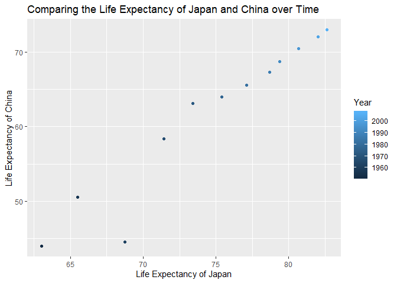

Homework 04
================
Annie
08/10/2019

This assignment explores tidy data using the dataset gapminder.

**Univariate Option 1** Below I have made a tibble with one row per
year, and columns for the life expectancy of Japan, China, and Thailand.

``` r
gapminder_JaChTh <- gapminder %>%
  filter(country == 'Japan' | country == 'China' | country == 'Thailand')

JaChTh_wide <- gapminder_JaChTh %>%
  pivot_wider(id_cols = year, 
              names_from = country, 
              values_from = lifeExp)
JaChTh_wide
```

    ## # A tibble: 12 x 4
    ##     year China Japan Thailand
    ##    <int> <dbl> <dbl>    <dbl>
    ##  1  1952  44    63.0     50.8
    ##  2  1957  50.5  65.5     53.6
    ##  3  1962  44.5  68.7     56.1
    ##  4  1967  58.4  71.4     58.3
    ##  5  1972  63.1  73.4     60.4
    ##  6  1977  64.0  75.4     62.5
    ##  7  1982  65.5  77.1     64.6
    ##  8  1987  67.3  78.7     66.1
    ##  9  1992  68.7  79.4     67.3
    ## 10  1997  70.4  80.7     67.5
    ## 11  2002  72.0  82       68.6
    ## 12  2007  73.0  82.6     70.6

Below is a scatterplot of the life expectancy of Japan vs. China.

``` r
JaChTh_wide %>%
  ggplot(aes(Japan, China, color = year)) +
  geom_point()+
    labs(x = "Life Expectancy of Japan", y = "Life Expectancy of China", title = "Comparing the Life Expectancy of Japan and China over Time") +
    scale_color_continuous("Year")
```

<!-- -->

Now, I will relengthen the dataset.

``` r
JaChTh_long <- JaChTh_wide %>%
  pivot_longer(cols = -year,
               names_to = "Country",
               values_to = "Life Expectancy")
#For cols, I could also insert Japan:Thailand
JaChTh_long
```

    ## # A tibble: 36 x 3
    ##     year Country  `Life Expectancy`
    ##    <int> <chr>                <dbl>
    ##  1  1952 China                 44  
    ##  2  1952 Japan                 63.0
    ##  3  1952 Thailand              50.8
    ##  4  1957 China                 50.5
    ##  5  1957 Japan                 65.5
    ##  6  1957 Thailand              53.6
    ##  7  1962 China                 44.5
    ##  8  1962 Japan                 68.7
    ##  9  1962 Thailand              56.1
    ## 10  1967 China                 58.4
    ## # ... with 26 more rows

**Multivariate Option 2**

Below I will compute the mean life expectancy and GDP per capita for all
possible combinations of continent and year.

``` r
meanlife_gdp <- gapminder %>%
  group_by(continent, year) %>%
  summarize(meanlife = mean(lifeExp), meangdp = mean(gdpPercap))

meanlifegdp_wide <- meanlife_gdp %>%
  pivot_wider(id_cols = c(year),
              names_from = continent,
              names_sep = "_",
              values_from = c(meanlife, meangdp))
meanlifegdp_wide
```

    ## # A tibble: 12 x 11
    ##     year meanlife_Africa meanlife_Americ~ meanlife_Asia meanlife_Europe
    ##    <int>           <dbl>            <dbl>         <dbl>           <dbl>
    ##  1  1952            39.1             53.3          46.3            64.4
    ##  2  1957            41.3             56.0          49.3            66.7
    ##  3  1962            43.3             58.4          51.6            68.5
    ##  4  1967            45.3             60.4          54.7            69.7
    ##  5  1972            47.5             62.4          57.3            70.8
    ##  6  1977            49.6             64.4          59.6            71.9
    ##  7  1982            51.6             66.2          62.6            72.8
    ##  8  1987            53.3             68.1          64.9            73.6
    ##  9  1992            53.6             69.6          66.5            74.4
    ## 10  1997            53.6             71.2          68.0            75.5
    ## 11  2002            53.3             72.4          69.2            76.7
    ## 12  2007            54.8             73.6          70.7            77.6
    ## # ... with 6 more variables: meanlife_Oceania <dbl>, meangdp_Africa <dbl>,
    ## #   meangdp_Americas <dbl>, meangdp_Asia <dbl>, meangdp_Europe <dbl>,
    ## #   meangdp_Oceania <dbl>

Next, I will lengthen the data.

``` r
meanlifegdp_long <- meanlifegdp_wide %>%
  pivot_longer(cols = contains("mean"), 
               names_to = c(".value", "continent"),
               names_sep = "_")
meanlifegdp_long
```

    ## # A tibble: 60 x 4
    ##     year continent meanlife meangdp
    ##    <int> <chr>        <dbl>   <dbl>
    ##  1  1952 Africa        39.1   1253.
    ##  2  1952 Americas      53.3   4079.
    ##  3  1952 Asia          46.3   5195.
    ##  4  1952 Europe        64.4   5661.
    ##  5  1952 Oceania       69.3  10298.
    ##  6  1957 Africa        41.3   1385.
    ##  7  1957 Americas      56.0   4616.
    ##  8  1957 Asia          49.3   5788.
    ##  9  1957 Europe        66.7   6963.
    ## 10  1957 Oceania       70.3  11599.
    ## # ... with 50 more rows

**Table Joins**

For this exercise, I am going to add the appropriate email address for
every guest. There are certain guests that do not have an email.

``` r
email_new <- separate_rows(email, guest, sep=", ") %>%
  rename(name = guest)

guest_email <- guest %>% 
  left_join(email_new, by = "name")
guest_email
```

    ## # A tibble: 30 x 8
    ##    party name  meal_wedding meal_brunch attendance_wedd~ attendance_brun~
    ##    <dbl> <chr> <chr>        <chr>       <chr>            <chr>           
    ##  1     1 Somm~ PENDING      PENDING     PENDING          PENDING         
    ##  2     1 Phil~ vegetarian   Menu C      CONFIRMED        CONFIRMED       
    ##  3     1 Blan~ chicken      Menu A      CONFIRMED        CONFIRMED       
    ##  4     1 Emaa~ PENDING      PENDING     PENDING          PENDING         
    ##  5     2 Blai~ chicken      Menu C      CONFIRMED        CONFIRMED       
    ##  6     2 Nige~ <NA>         <NA>        CANCELLED        CANCELLED       
    ##  7     3 Sine~ PENDING      PENDING     PENDING          PENDING         
    ##  8     4 Ayra~ vegetarian   Menu B      PENDING          PENDING         
    ##  9     5 Atla~ PENDING      PENDING     PENDING          PENDING         
    ## 10     5 Denz~ fish         Menu B      CONFIRMED        CONFIRMED       
    ## # ... with 20 more rows, and 2 more variables: attendance_golf <chr>,
    ## #   email <chr>

``` r
#If I only wanted to return guests with emails, I would use an inner join instead of a left join.
```

Below is a list of the people that we have emails for, yet are not on
the guest list.

``` r
email_notguest <- email_new %>%
  anti_join(guest_email, by = "name")
email_notguest
```

    ## # A tibble: 3 x 2
    ##   name            email                          
    ##   <chr>           <chr>                          
    ## 1 Turner Jones    tjjones12@hotmail.ca           
    ## 2 Albert Marshall themarshallfamily1234@gmail.com
    ## 3 Vivian Marshall themarshallfamily1234@gmail.com

This list includes everyone that we have emails for, and everyone on the
original guest list.

``` r
email_notguest %>%
  bind_rows(guest_email) %>%
  select(name, email)
```

    ## # A tibble: 33 x 2
    ##    name            email                          
    ##    <chr>           <chr>                          
    ##  1 Turner Jones    tjjones12@hotmail.ca           
    ##  2 Albert Marshall themarshallfamily1234@gmail.com
    ##  3 Vivian Marshall themarshallfamily1234@gmail.com
    ##  4 Sommer Medrano  sommm@gmail.com                
    ##  5 Phillip Medrano sommm@gmail.com                
    ##  6 Blanka Medrano  sommm@gmail.com                
    ##  7 Emaan Medrano   sommm@gmail.com                
    ##  8 Blair Park      bpark@gmail.com                
    ##  9 Nigel Webb      bpark@gmail.com                
    ## 10 Sinead English  singlish@hotmail.ca            
    ## # ... with 23 more rows
