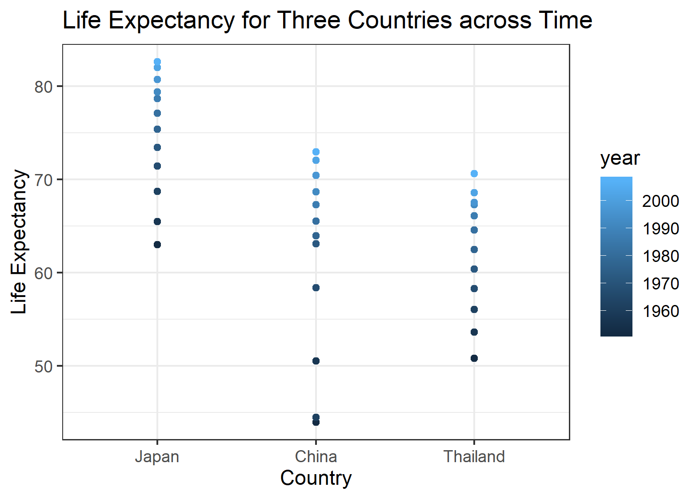

Woah! This is my final assignment for STAT545A. In this assignment, I will use the gapminder dataset to explore factor and figure management. 
```{r setup, include=FALSE, message = FALSE, warning = FALSE}
knitr::opts_chunk$set(echo = TRUE)

library(gapminder)
library(tidyverse)
library(ggplot2)
library(here)
```

**Exercise 1 - here::here package**
Let's start by discussing a R package. here::here is an important package to learn and use in R because it enables the user to store/extract data to a root directory in a safe and reproducible manner. What are the main selling points of here::here?
1. The here package is operating system and platform-independent. It will work within Windows or Mac. 
2. Using the here package, a user cannot invent a path or folder names, you will receive an error if there is a typo or the path does not exist.
3. It identifies the root directory for you, and you can create folders (or not!) within the directory, if you would like to store your data within sub-directories. 

**Exercise 2 - Factor Management**
I am going to explore the continent variable within the gapminder dataset. First, I need to confirm that the variable is a factor. 
```{r}
gapminder$continent %>%
  str()
```

How many levels are in the continent variable?
```{r}
gapminder$continent %>%
  nlevels()
```

How many rows are in the continent variable? The tibble below shows the number of rows by continent. 
```{r}
gapminder %>%
  count(continent)
```

Now, I will drop Oceania and remove unused factor levels. As you can see, the number of levels has changed from 5 to 4. 
```{r}
oceania_dropped <- gapminder %>% 
  filter(continent != 'Oceania') %>%
  droplevels() #This function removes unused levels. 

oceania_dropped$continent %>%
  nlevels()
```

How many rows are in the continent variable now? There is the same number of rows in every continent, excluding Oceania (the dropped variable).
```{r}
oceania_dropped %>%
  count(continent)
```

Now, I am going to reorder the levels of the variable continent using the forcats package. The first graph shows the levels before it is reordered. As you can see, the continents are arranged in alphabetical order. The second graph includes the reordering of the levels. 
```{r}
gap_max_gdp <- gapminder %>%
  group_by(continent) %>%
  summarize(max(gdpPercap)) %>%
  rename (max_gdp = 'max(gdpPercap)')

gap_max_gdp %>%
  ggplot() +
  geom_col(aes(continent, max_gdp)) +
  theme_bw() +
  ylab("Maximum GDP per Capita") + xlab("Continent")
```

This is the second graph that demonstrates how I reordered the levels. 
```{r}
gap_max_gdp %>%
  ggplot() +
  geom_col(aes(forcats::fct_relevel(continent, "Asia", "Europe", "Americas", "Oceania"), max_gdp)) +
  theme_bw() +
  ylab("Maximum GDP per Capita") + xlab("Continent")
```

**Exercise 3 - File Input and Output** For this exercise, I have created a subset of the gapminder dataset and written the data to a csv that I have stored directly in my homework folder.
```{r}
gapminder_JaChTh <- gapminder %>%
  filter(country == 'Japan' | country == 'China' | country == 'Thailand')
write_csv(gapminder_JaChTh, here::here("Assignment 5", "gapminder_JaChTh.csv"))
```

Below, I have reloaded the data back. It survived the trip and was successfully read back into this R Markdown file!
```{r}
gapminder_JaChTh_read <- read_csv(here("Assignment 5", "gapminder_JaChTh.csv"))
gapminder_JaChTh_read 
```

Now, I am going to use a factor to color the lines by country. 
```{r}
ggplot(gapminder_JaChTh_read, aes(x = year, y = pop,
                  color = fct_reorder2(country, year, pop))) +
  geom_line() +
  labs(color = "country")

```

I can also use a factor to reorder the Life Expectancy graph below so that the countries are not arranged in alphabetical order. 

```{r}
lifeExp_asia_graph <- gapminder_JaChTh_read %>%
  ggplot() +
  geom_point(aes(forcats::fct_relevel(country, "Japan", "China", "Thailand"), lifeExp, color = year)) +
  theme_bw() +
  labs(title = "Life Expectancy for Three Countries across Time", x = "Country", y = "Life Expectancy")
lifeExp_asia_graph
```


**Exercise 4 - Visualization** For this exercise, I have chosen a graph from an old assignment. I don't think that this graph accurately represents GDP per Capita across continents. It does not show the distribution of GDP per Capita, only the minimum and maximum.
```{r}
gdpmin_max <- gapminder %>%
  group_by(continent) %>%
  filter(year == 2007) %>%
  summarize(min_gdp = min(gdpPercap), 
            min_country = country[gdpPercap == min_gdp],
            max_gdp = max(gdpPercap), 
            max_country = country[gdpPercap == max_gdp])
gdpmin_max %>% 
  ggplot(aes())+
    geom_point(aes(continent, min_gdp, color = "Min GDP")) +
    geom_point(aes(continent, max_gdp, color = "Max GDP")) +
  labs(x = "Continent", y = "GDP per Capita") +
  scale_y_log10(labels = scales::dollar_format()) +
  scale_color_discrete("Legend")
```

So, I have decided to create a boxplot to better represent the data. In addition, I have included a title, and used a more minimal theme for the background. I have also been careful when manipulating the aesthetics. For instance, the outliers have no fill, and I have made the width of each boxplot smaller than the default. So, I believe this graph is more representative and more visually appealing than my previous graph.
```{r}
gapminder %>%
  ggplot(aes(continent, gdpPercap, fill = continent)) +
  geom_boxplot(width = 0.65, outlier.shape = 1, show.legend = FALSE) + 
  labs(title = "The Distribution of GDP per Capita across Continents", x = "Continent", y = "GDP per Capita") +
  scale_y_log10(labels = scales::dollar_format()) +
  theme_minimal()
```

**Exercise 5 - Saving Images** Below, I have used ggsave. It is important to use plot = as an argument, otherwise the default would be the last plot displayed. 
```{r}
ggsave("lifeExp_asia_graph.png", plot = lifeExp_asia_graph, scale = 0.75, dpi = 300, limitsize = TRUE)
```


