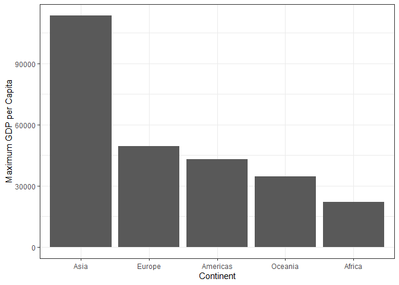
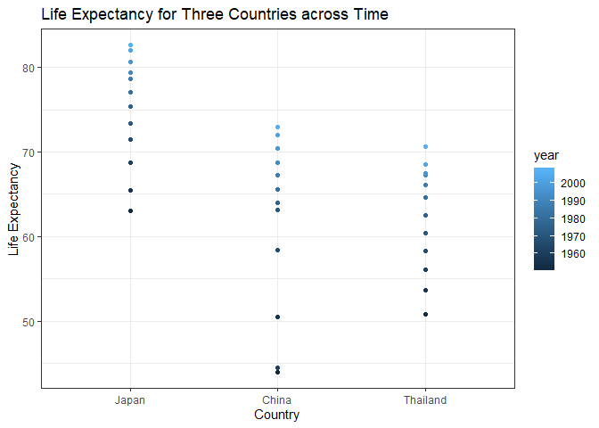
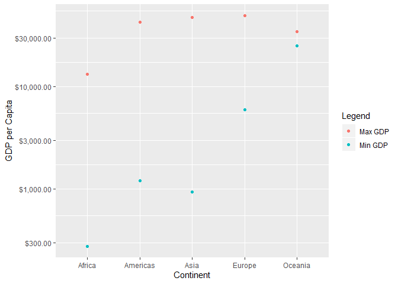
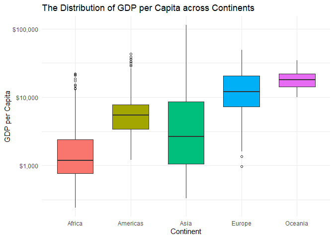
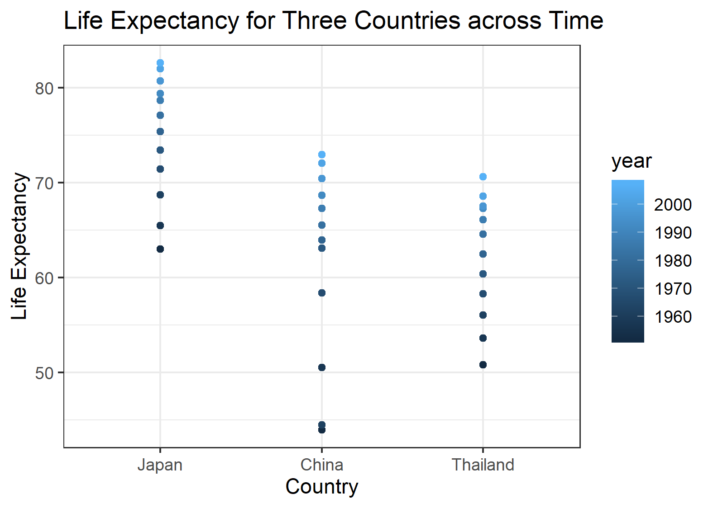

Assignment 5
================
Annie
16/10/2019

Woah\! This is my final assignment for STAT545A. In this assignment, I
will use the gapminder dataset to explore factor and figure management.

**Exercise 1 - here::here package** Let’s start by discussing a R
package. here::here is an important package to learn and use in R
because it enables the user to store/extract data to a root directory in
a safe and reproducible manner. What are the main selling points of
here::here? 1. The here package is operating system and
platform-independent. It will work within Windows or Mac. 2. Using the
here package, a user cannot invent a path or folder names, you will
receive an error if there is a typo or the path does not exist. 3. It
identifies the root directory for you, and you can create folders (or
not\!) within the directory, if you would like to store your data within
sub-directories.

**Exercise 2 - Factor Management** I am going to explore the continent
variable within the gapminder dataset. First, I need to confirm that the
variable is a factor.

``` r
gapminder$continent %>%
  str()
```

    ##  Factor w/ 5 levels "Africa","Americas",..: 3 3 3 3 3 3 3 3 3 3 ...

How many levels are in the continent variable?

``` r
gapminder$continent %>%
  nlevels()
```

    ## [1] 5

How many rows are in the continent variable? The tibble below shows the
number of rows by continent.

``` r
gapminder %>%
  count(continent)
```

    ## # A tibble: 5 x 2
    ##   continent     n
    ##   <fct>     <int>
    ## 1 Africa      624
    ## 2 Americas    300
    ## 3 Asia        396
    ## 4 Europe      360
    ## 5 Oceania      24

Now, I will drop Oceania and remove unused factor levels. As you can
see, the number of levels has changed from 5 to 4.

``` r
oceania_dropped <- gapminder %>% 
  filter(continent != 'Oceania') %>%
  droplevels() #This function removes unused levels. 

oceania_dropped$continent %>%
  nlevels()
```

    ## [1] 4

How many rows are in the continent variable now? There is the same
number of rows in every continent, excluding Oceania (the dropped
variable).

``` r
oceania_dropped %>%
  count(continent)
```

    ## # A tibble: 4 x 2
    ##   continent     n
    ##   <fct>     <int>
    ## 1 Africa      624
    ## 2 Americas    300
    ## 3 Asia        396
    ## 4 Europe      360

Now, I am going to reorder the levels of the variable continent using
the forcats package. The first graph shows the levels before it is
reordered. As you can see, the continents are arranged in alphabetical
order. The second graph includes the reordering of the levels.

``` r
gap_max_gdp <- gapminder %>%
  group_by(continent) %>%
  summarize(max(gdpPercap)) %>%
  rename (max_gdp = 'max(gdpPercap)')

gap_max_gdp %>%
  ggplot() +
  geom_col(aes(continent, max_gdp)) +
  theme_bw() +
  ylab("Maximum GDP per Capita") + xlab("Continent")
```

<!-- -->

This is the second graph that demonstrates how I reordered the levels.

``` r
gap_max_gdp %>%
  ggplot() +
  geom_col(aes(forcats::fct_relevel(continent, "Asia", "Europe", "Americas", "Oceania"), max_gdp)) +
  theme_bw() +
  ylab("Maximum GDP per Capita") + xlab("Continent")
```

<!-- -->

**Exercise 3 - File Input and Output** For this exercise, I have created
a subset of the gapminder dataset and written the data to a csv that I
have stored directly in my homework folder.

``` r
gapminder_JaChTh <- gapminder %>%
  filter(country == 'Japan' | country == 'China' | country == 'Thailand')
write_csv(gapminder_JaChTh, here::here("Assignment 5", "gapminder_JaChTh.csv"))
```

Below, I have reloaded the data back. It survived the trip and was
successfully read back into this R Markdown
file\!

``` r
gapminder_JaChTh_read <- read_csv(here("Assignment 5", "gapminder_JaChTh.csv"))
```

    ## Parsed with column specification:
    ## cols(
    ##   country = col_character(),
    ##   continent = col_character(),
    ##   year = col_double(),
    ##   lifeExp = col_double(),
    ##   pop = col_double(),
    ##   gdpPercap = col_double()
    ## )

``` r
gapminder_JaChTh_read 
```

    ## # A tibble: 36 x 6
    ##    country continent  year lifeExp        pop gdpPercap
    ##    <chr>   <chr>     <dbl>   <dbl>      <dbl>     <dbl>
    ##  1 China   Asia       1952    44    556263527      400.
    ##  2 China   Asia       1957    50.5  637408000      576.
    ##  3 China   Asia       1962    44.5  665770000      488.
    ##  4 China   Asia       1967    58.4  754550000      613.
    ##  5 China   Asia       1972    63.1  862030000      677.
    ##  6 China   Asia       1977    64.0  943455000      741.
    ##  7 China   Asia       1982    65.5 1000281000      962.
    ##  8 China   Asia       1987    67.3 1084035000     1379.
    ##  9 China   Asia       1992    68.7 1164970000     1656.
    ## 10 China   Asia       1997    70.4 1230075000     2289.
    ## # ... with 26 more rows

Now, I am going to use a factor to color the lines by country.

``` r
ggplot(gapminder_JaChTh_read, aes(x = year, y = pop,
                  color = fct_reorder2(country, year, pop))) +
  geom_line() +
  labs(color = "country")
```

<!-- -->

I can also use a factor to reorder the Life Expectancy graph below so
that the countries are not arranged in alphabetical order.

``` r
lifeExp_asia_graph <- gapminder_JaChTh_read %>%
  ggplot() +
  geom_point(aes(forcats::fct_relevel(country, "Japan", "China", "Thailand"), lifeExp, color = year)) +
  theme_bw() +
  labs(title = "Life Expectancy for Three Countries across Time", x = "Country", y = "Life Expectancy")
lifeExp_asia_graph
```

<!-- -->

**Exercise 4 - Visualization** For this exercise, I have chosen a graph
from an old assignment. I don’t think that this graph accurately
represents GDP per Capita across continents. It does not show the
distribution of GDP per Capita, only the minimum and maximum.

``` r
gdpmin_max <- gapminder %>%
  group_by(continent) %>%
  filter(year == 2007) %>%
  summarize(min_gdp = min(gdpPercap), 
            min_country = country[gdpPercap == min_gdp],
            max_gdp = max(gdpPercap), 
            max_country = country[gdpPercap == max_gdp])
gdpmin_max %>% 
  ggplot(aes())+
    geom_point(aes(continent, min_gdp, color = "Min GDP")) +
    geom_point(aes(continent, max_gdp, color = "Max GDP")) +
  labs(x = "Continent", y = "GDP per Capita") +
  scale_y_log10(labels = scales::dollar_format()) +
  scale_color_discrete("Legend")
```

<!-- -->

So, I have decided to create a boxplot to better represent the data. In
addition, I have included a title, and used a more minimal theme for the
background. I have also been careful when manipulating the aesthetics.
For instance, the outliers have no fill, and I have made the width of
each boxplot smaller than the default. So, I believe this graph is more
representative and more visually appealing than my previous graph.

``` r
gapminder %>%
  ggplot(aes(continent, gdpPercap, fill = continent)) +
  geom_boxplot(width = 0.65, outlier.shape = 1, show.legend = FALSE) + 
  labs(title = "The Distribution of GDP per Capita across Continents", x = "Continent", y = "GDP per Capita") +
  scale_y_log10(labels = scales::dollar_format()) +
  theme_minimal()
```

<!-- -->

**Exercise 5 - Saving Images** Below, I have used ggsave. It is
important to use plot = as an argument, otherwise the default would be
the last plot
displayed.

``` r
ggsave("lifeExp_asia_graph.png", plot = lifeExp_asia_graph, scale = 0.75, dpi = 300, limitsize = TRUE)
```

    ## Saving 5.25 x 3.75 in image


